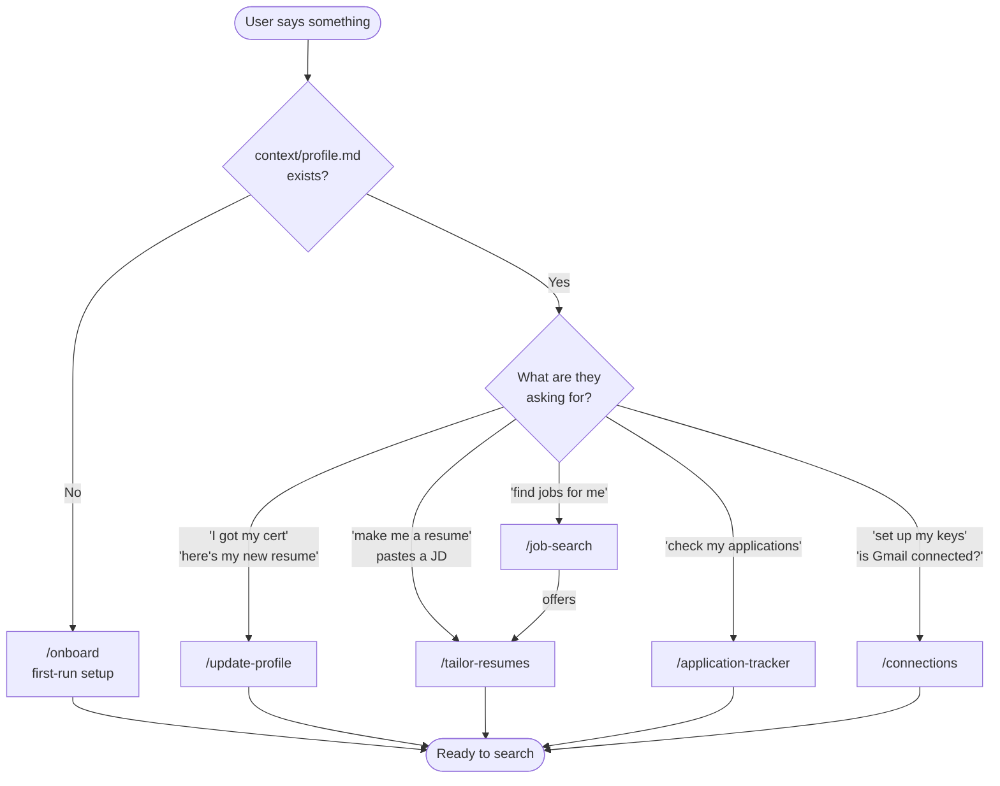
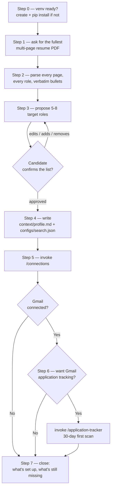
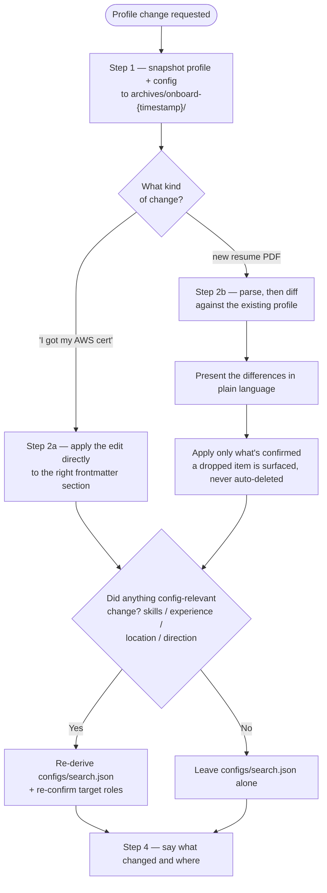
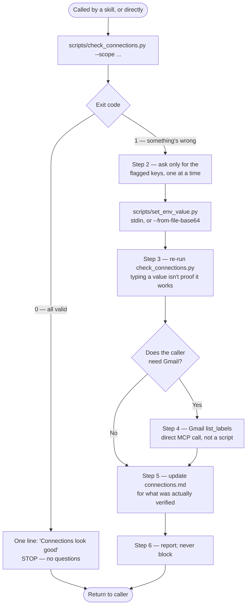
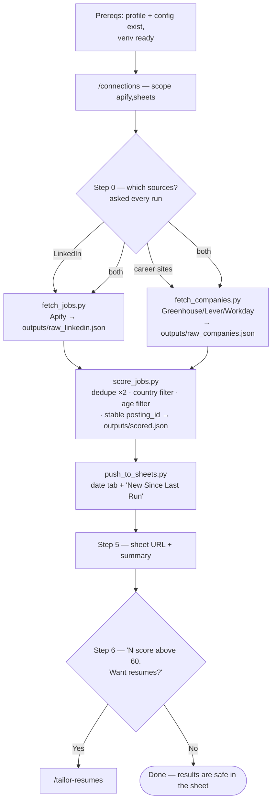
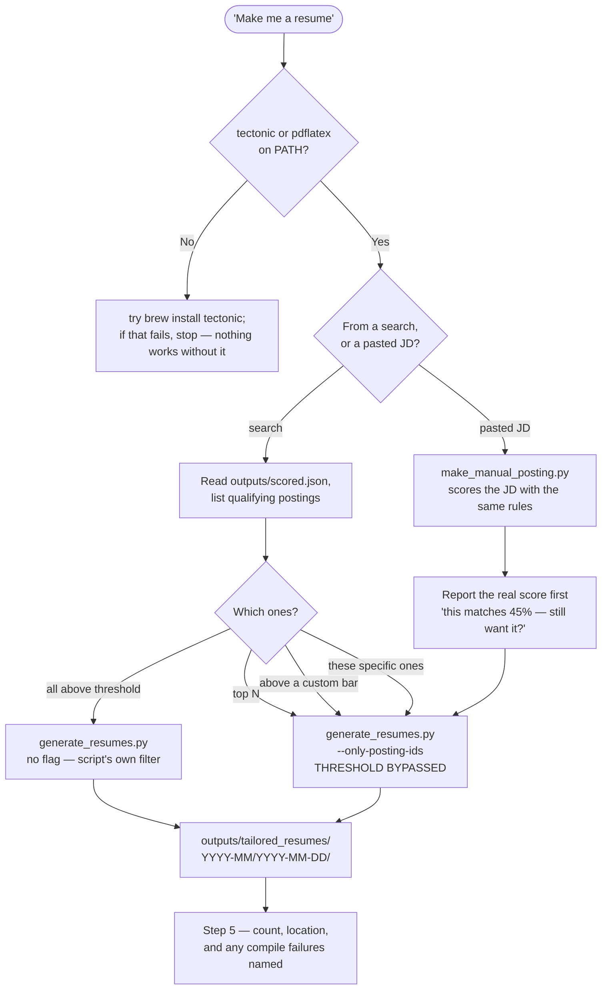
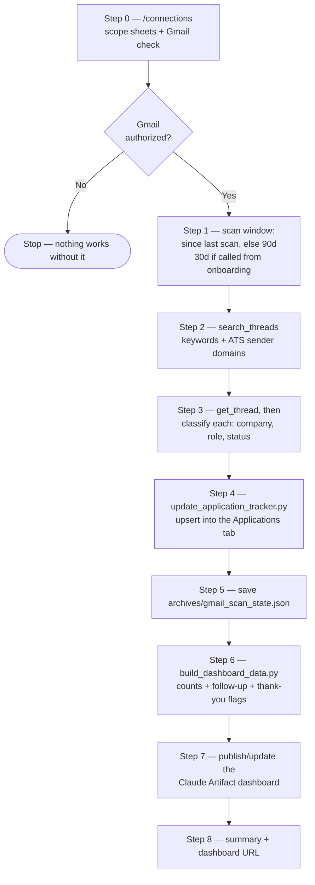
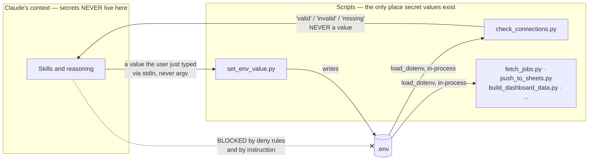
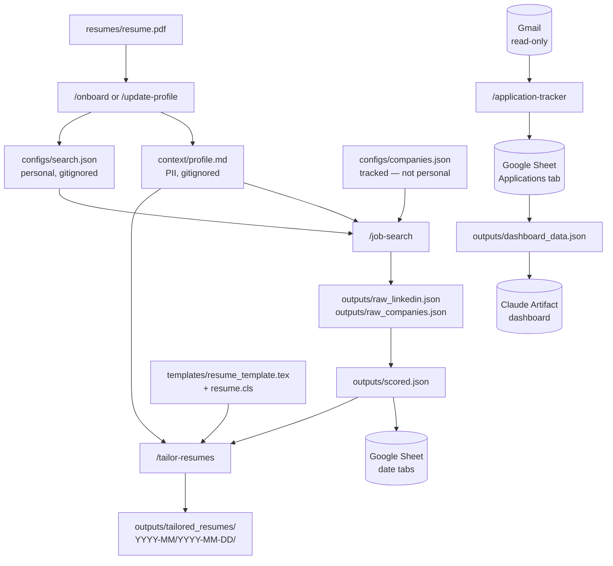

# Architecture

How Job Hunter is put together: what happens when someone talks to it, which skill handles what, which scripts do the work, and where secrets are allowed to go.

Diagrams are Mermaid, so GitHub renders them inline.

---

## 1. Routing — what happens when someone says something

Everything starts here. The single most important branch is whether a profile exists yet.

Onboarding wins over the literal request: if there's no profile, "find jobs for me" runs `/onboard` first, because a search without a profile has nothing to search *for*.

---

## 2. `/onboard` — first run only

Runs once. If a profile already exists it hands off to `/update-profile` rather than duplicating that logic.

Target roles are **always** confirmed, never silently inferred — a resume can support several directions.

---

## 3. `/update-profile` — every change after setup

A new certificate with no new skills shouldn't trigger a config rewrite or another round of questions — that's what the `Q` branch protects.

---

## 4. `/connections` — check first, only ask about what's broken

This is what makes verifying on **every** run tolerable instead of nagging.

Gmail is checked with a direct MCP call because MCP tools aren't reachable from a subprocess — everything else goes through the script.

---

## 5. `/job-search` — ends at the sheet

The skill deliberately **stops at the sheet**. Resume generation is a separate skill so a LaTeX failure or an unwanted 40-PDF compile can't ride on top of a search that already succeeded.

If `configs/companies.json` doesn't exist, Step 0 is skipped entirely — there's nothing to choose between.

---

## 6. `/tailor-resumes` — five ways in

`--only-posting-ids` bypassing the threshold is what makes modes 2–5 work: an explicit human choice outranks a configured default, including for a pasted JD that scores below the bar.

Manual-JD resumes are **not** written to the sheet — they didn't come from a search, and adding them would corrupt the record of what each day's search actually found.

---

## 7. `/application-tracker` — Gmail in, dashboard out

**Read-only, always** — `search_threads` and `get_thread` only. Never labels, never mutations, never a drafted or sent email. The "send a thank-you" idea is a *flag on the dashboard*, nothing more.

The dashboard URL is persisted in `archives/dashboard_state.json` so re-runs update the same page instead of creating a new one each time.

---

## 8. The secrets boundary

The one architectural rule that isn't about convenience.

Rules this encodes:

- Claude never reads, `cat`s, `grep`s, or `sed`s `.env` — not even to check whether a key is set. `Read(./.env*)` is denied in `.claude/settings.local.json`.
- Status comes out as a word, never a value. No lengths, no prefixes, no suffixes.
- Values go in via **stdin** (argv is visible in process listings) or `--from-file-base64`, which encodes a service-account key in-process so the credential never reaches a terminal.
- API tokens are sent as `Authorization` headers, never URL query params — a token in a URL leaks into `requests` exception messages, which get printed and logged.

---

## 9. Files and where they come from

The two halves are **deliberately unconnected**: the job-postings sheet and the Gmail dashboard never reference each other. The sheet is what the search found; the dashboard is what email says happened to applications — including ones this tool never surfaced.

---

## Design rules worth knowing

| Rule | Why |
|---|---|
| Scripts are dumb; Claude reasons | No LLM calls inside code. Scripts take a config, produce data — testable in isolation, zero token cost per row. |
| MCP for judgment, scripts for plumbing | Gmail needs an MCP because classifying an email is real reasoning. Sheets is a script because merging rows isn't. |
| Verify, don't assume | Company ATS details are confirmed against real endpoints, never guessed. A stored credential is checked with a live call, not a presence check. |
| Fail visibly, never silently | Per-item failures are logged and skipped; pipeline failures stop the run. A posting whose date can't be parsed is kept *and counted*. |
| Explicit choice beats configuration | `--only-posting-ids` overrides the score threshold, because a person naming a posting outranks a default. |

See [`decisions/log.md`](../decisions/log.md) for the reasoning behind specific choices, and [`connections.md`](../connections.md) for what's wired to what.
